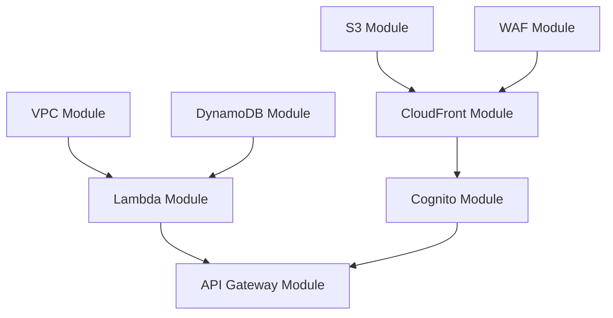

# ============================================
# README - EL MUNDO FITNESS
# Infraestructura como Código (Terraform)
# ============================================

## 📋 Descripción

Infraestructura completa de AWS para la aplicación "El Mundo Fitness" usando Terraform. Arquitectura serverless con VPC privada, CloudFront, WAF, API Gateway, Lambda, DynamoDB y Cognito.

## 🏗️ Arquitectura

```
Usuario
  ↓
CloudFront (CDN) + WAF ←→ S3 (Frontend)
  ↓
API Gateway (HTTP) + Cognito JWT Authorizer
  ↓
Lambda Functions (VPC Privada)
  ├── Subscription Control → NAT Gateway → Stripe API
  ├── Access Control → VPC Endpoint → DynamoDB
  └── Notification Service → NAT Gateway → SES/Gmail
```

### Componentes Desplegados

| Servicio | Propósito | Características |
|----------|-----------|-----------------|
| **CloudFront** | CDN para frontend | Distribución global, caché, OAC |
| **WAF** | Seguridad web | Rate limiting, reglas AWS managed |
| **S3** | Almacenamiento | Frontend estático, versionado |
| **API Gateway** | API HTTP | Integración Lambda, CORS |
| **Cognito** | Autenticación | User Pool, JWT Authorizer |
| **Lambda** | Compute | 3 funciones en VPC privada |
| **DynamoDB** | Base de datos | 3 tablas con GSI |
| **VPC** | Red | Subnets públicas/privadas, NAT |

## 📁 Estructura del Proyecto

```
IAC VALVERDE/
├── main.tf                    # Orquestador principal (llama a todos los módulos)
├── variables.tf               # Variables globales
├── outputs.tf                 # Outputs consolidados
├── terraform.tfvars           # Valores por defecto
├── Jenkinsfile                # Pipeline CI/CD
│
├── environments/
│   ├── dev/
│   │   └── terraform.tfvars   # Variables para DEV
│   └── prod/
│       └── terraform.tfvars   # Variables para PROD
│
└── modules/
    ├── vpc/                   # Red (VPC, subnets, NAT, VPC endpoints)
    ├── dynamodb/              # Tablas (usuarios, pagos, historial)
    ├── s3/                    # Bucket frontend
    ├── lambda/                # 3 funciones Lambda
    ├── api-gateway/           # API HTTP con integración Lambda
    ├── cognito/               # User Pool + Client
    ├── cloudfront/            # Distribución CDN con OAC
    └── waf/                   # Web ACL con reglas
```

## 🚀 Despliegue Rápido

### 1. Prerrequisitos

```powershell
# Terraform >= 1.0
terraform --version

# AWS CLI configurado
aws configure

# Credenciales con permisos para:
# - VPC, EC2, Lambda, DynamoDB, S3, API Gateway, Cognito, CloudFront, WAF
```

### 2. Inicializar Terraform

```powershell
cd "c:\Users\franc\Downloads\IAC VALVERDE"
terraform init
```

### 3. Validar Configuración

```powershell
terraform validate
terraform fmt
```

### 4. Planear Despliegue (DEV)

```powershell
terraform plan -var-file="environments/dev/terraform.tfvars"
```

### 5. Aplicar Infraestructura

```powershell
# Despliegue en DEV
terraform apply -var-file="environments/dev/terraform.tfvars"

# Despliegue en PROD (cuando esté listo)
terraform apply -var-file="environments/prod/terraform.tfvars"
```

### 6. Obtener Outputs

```powershell
terraform output

# Output específico
terraform output cloudfront_url
terraform output api_gateway_url
terraform output cognito_user_pool_id
```

## 📦 Dependencias entre Módulos



## 🔧 Configuración Post-Despliegue

### 1. Subir Frontend a S3

```powershell
# Build del frontend
cd frontend
npm run build

# Subir a S3
$bucketName = terraform output -raw s3_frontend_bucket_name
aws s3 sync ./build s3://$bucketName/ --delete

# Invalidar caché de CloudFront
$distributionId = terraform output -raw cloudfront_distribution_id
aws cloudfront create-invalidation --distribution-id $distributionId --paths "/*"
```

### 2. Actualizar Código Lambda

```powershell
# Crear ZIP de la función
cd lambda-functions/subscription-control
npm install
Compress-Archive -Path * -DestinationPath function.zip -Force

# Subir a Lambda
$functionName = "el-mundo-fitness-dev-subscription-control"
aws lambda update-function-code `
  --function-name $functionName `
  --zip-file fileb://function.zip
```

### 3. Configurar Variables de Entorno (Frontend)

Crear archivo `.env` en el frontend:

```env
REACT_APP_API_URL=<terraform output api_gateway_url>
REACT_APP_COGNITO_USER_POOL_ID=<terraform output cognito_user_pool_id>
REACT_APP_COGNITO_CLIENT_ID=<terraform output cognito_client_id>
REACT_APP_COGNITO_REGION=us-east-1
```

### 4. Crear Usuario de Prueba en Cognito

```powershell
$userPoolId = terraform output -raw cognito_user_pool_id

aws cognito-idp admin-create-user `
  --user-pool-id $userPoolId `
  --username testuser@example.com `
  --user-attributes Name=email,Value=testuser@example.com Name=email_verified,Value=true `
  --temporary-password "TempPass123!" `
  --message-action SUPPRESS
```

## 🛡️ Seguridad

### Características Implementadas

- ✅ **WAF**: Rate limiting (2000 req/5min), SQL injection protection, AWS managed rules
- ✅ **Cognito JWT Authorizer**: Protege todos los endpoints de API Gateway
- ✅ **VPC Privada**: Lambdas sin acceso directo a Internet
- ✅ **NAT Gateway**: Salida controlada para llamadas externas (Stripe, SES)
- ✅ **VPC Endpoints**: Acceso a DynamoDB y S3 sin pasar por Internet
- ✅ **CloudFront OAC**: Acceso seguro a S3 (no público)
- ✅ **Encryption**: DynamoDB y S3 con cifrado en reposo

### Mejoras de Seguridad (Opcional)

```hcl
# En modules/cognito/main.tf
resource "aws_cognito_user_pool" "main" {
  mfa_configuration = "ON"  # Cambiar de OFF a ON

  software_token_mfa_configuration {
    enabled = true
  }
}
```

## 💰 Estimación de Costos (us-east-1)

| Servicio | Costo Mensual Estimado |
|----------|------------------------|
| NAT Gateway | $32-45 + data transfer |
| Lambda | $0-5 (1M requests gratis) |
| DynamoDB | $1-10 (on-demand) |
| API Gateway | $0-3 (1M gratis) |
| CloudFront | $0 (1TB gratis por 12 meses) |
| S3 | $0.50-2 |
| Cognito | $0 (50K MAU gratis) |
| WAF | $5 + rules |
| **TOTAL** | **$40-70/mes** |

### Optimización de Costos

1. **Eliminar NAT Gateway** (ahorro $32-45/mes):
   - Usar Lambda sin VPC para funciones que no necesitan DynamoDB
   - DynamoDB via VPC Endpoint
   
2. **Provisioned Capacity** (DynamoDB):
   - Cambiar a modo provisionado si tráfico predecible

3. **CloudFront Reserved Capacity**:
   - Ahorro del 20% con compromiso de 12 meses

## 🧪 Testing

### Test de API Gateway

```powershell
$apiUrl = terraform output -raw api_gateway_url

# Health check
Invoke-RestMethod -Uri "$apiUrl/health" -Method GET

# Endpoint protegido (requiere token JWT)
$token = "<JWT_TOKEN_FROM_COGNITO>"
$headers = @{
    "Authorization" = "Bearer $token"
}
Invoke-RestMethod -Uri "$apiUrl/subscriptions" -Method GET -Headers $headers
```

### Test de CloudFront

```powershell
$cloudfrontUrl = terraform output -raw cloudfront_url
Invoke-WebRequest -Uri $cloudfrontUrl
```

## 🔄 CI/CD con Jenkins

El archivo `Jenkinsfile` implementa un pipeline declarativo:

```groovy
stages:
  - Checkout
  - Terraform Init
  - Terraform Plan
  - Approval (manual)
  - Terraform Apply
  - Deploy Frontend
  - Invalidate CloudFront
```

### Configurar Jenkins

1. Crear Pipeline Job en Jenkins
2. Configurar credenciales AWS:
   - AWS Access Key ID: `AWS_ACCESS_KEY_ID`
   - AWS Secret Access Key: `AWS_SECRET_ACCESS_KEY`
3. Apuntar al Jenkinsfile en el repo

## 🗑️ Destrucción de Infraestructura

```powershell
# CUIDADO: Esto eliminará TODOS los recursos

# Primero, vaciar bucket S3
$bucketName = terraform output -raw s3_frontend_bucket_name
aws s3 rm s3://$bucketName --recursive

# Destruir infraestructura
terraform destroy -var-file="environments/dev/terraform.tfvars"
```

## 📚 Recursos Adicionales

- [Terraform AWS Provider](https://registry.terraform.io/providers/hashicorp/aws/latest/docs)
- [AWS Lambda Best Practices](https://docs.aws.amazon.com/lambda/latest/dg/best-practices.html)
- [CloudFront OAC vs OAI](https://docs.aws.amazon.com/AmazonCloudFront/latest/DeveloperGuide/private-content-restricting-access-to-s3.html)
- [API Gateway JWT Authorizers](https://docs.aws.amazon.com/apigateway/latest/developerguide/http-api-jwt-authorizer.html)

## 🐛 Troubleshooting

### Error: MFA Configuration

```
Error: Invalid MFA configuration given
```

**Solución**: En `modules/cognito/main.tf`, asegurar `mfa_configuration = "OFF"`

### Error: CloudFront Distribution Deployment

```
Error: Error creating CloudFront Distribution
```

**Solución**: CloudFront puede tardar 15-30 minutos en desplegar. Esperar y reintentar.

### Error: Lambda Timeout

```
Task timed out after 30.00 seconds
```

**Solución**: Aumentar `lambda_timeout` en `variables.tf` a 60 segundos.

### Error: NAT Gateway Costs

**Solución**: Si el costo es prohibitivo, considerar arquitectura sin VPC para Lambdas.

## 👥 Contribuciones

Proyecto desarrollado para El Mundo Fitness.

## 📄 Licencia

Privado - Todos los derechos reservados.

---

**Última actualización**: 2024
**Terraform Version**: >= 1.0
**AWS Provider**: ~> 5.0
